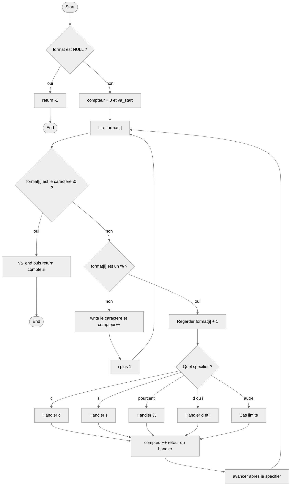

# _printf

_printf is a recreated version of the real C function printf. We developed
it as a project for Holberton School. It prints output according to a format
string and handles conversion specifiers like %c, %s and %%.

## Compilation

To compile the project, use the following command:
```bash
gcc -Wall -Werror -Wextra -pedantic -std=gnu89 -Wno-format *.c
```

## Requirements

* Ubuntu 20.04 LTS
* GCC compiler
* C standard: gnu89

## Examples
```c
_printf("Hello, %s!\n", "World");
```
Output:
```
Hello, World!
```
```c
_printf("The letter is: %c\n", 'A');
```
Output:
```
The letter is: A
```
```c
_printf("Discount: 50%%\n");
```
Output;
```
Discount: 50%
```

## Man page

To read the man page:
```bash
man ./man_3_printf
```

## Testing

Compile with a test file:
```bash
gcc -Wall -Werror -Wextra -pedantic -std=gnu89 -Wno-format -I. *.c tests/main.c -o tests/test
```

Check for memory leaks with Valgrind:
```bash
valgrind --leak-check=full ./tests/test
```

## Flowchart


## Authors

* Adam - [GitHub](https://github.com/Adamzou-lab)
* Panaki - [GitHub](https://github.com/Panaki-GILLOT)